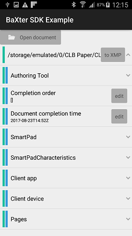
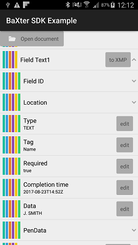
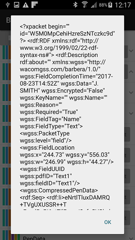

# Getting Started 

## Development Environment

The *Wacom Ink SDK for documents* is supplied as a .aar library for Android Studio, and requires a device with Android 4.3 or above.

## Download the SDK for documents

Download the SDK from https://developer.wacom.com/developer-dashboard

* Login using your Wacom ID
* Select **Downloads for documents**
* Download **Documents SDK for Android**
* Accept the End User License Agreement to use the SDK

The downloaded Zip file contains the SDK with documentation.

## Download an Evaluation License

A license is needed to use the SDK and a fully functional evaluation license is free to download as follows:

* Navigate to https://developer.wacom.com/developer-dashboard
* login using your Wacom ID
* Select **Licenses**
* Select **New Evaluation License**
* Select **Generate Evaluation License** for Wacom Ink SDK for documents
* Return to Licenses where the new license file is ready for download
* Download the license file

The license is supplied as a JWT text string in a text file.
This will need to be copied into your application.
The self-service evaluation licenses have a three-month expiry date from the time of creation.
However you can generate a new license at any time. 

----
## Sample Code

A sample project is provided to assist with a new development.
A prebuilt version is included in the SDK.

To use the sample install it on your Android device and open a PDF.
A demonstration file 'CLB Paper Sample.pdf' is included, it contains fields created using the Wacom Ink SDK for documents.

Open the file and use the icons to navigate the XMP data, for example:

      

  

----

